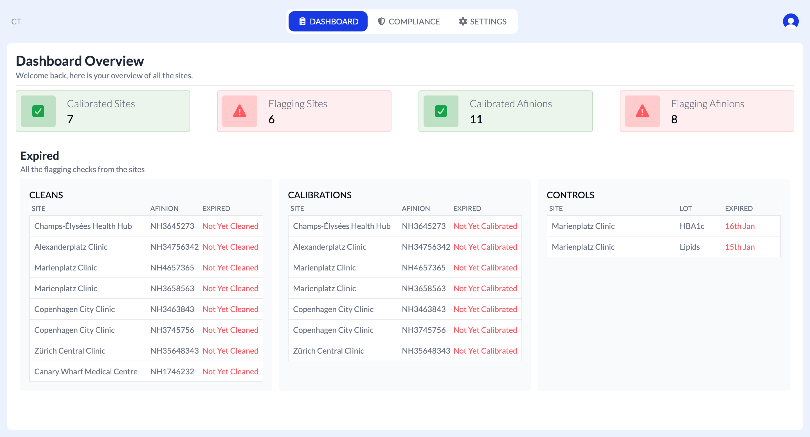
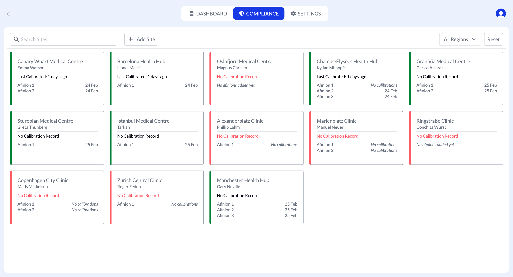
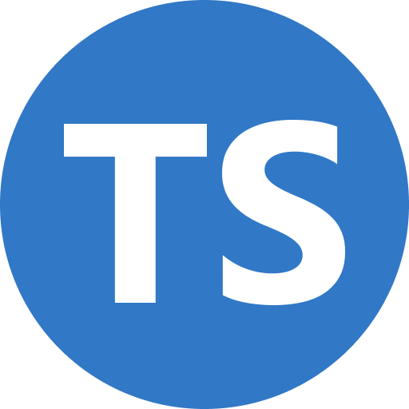
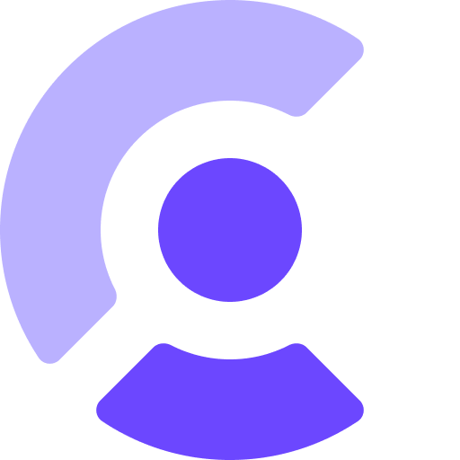

<h1 align="center">🧪 Afinion Compliance Tracker</h1>

    <a href="https://comply-hub.netlify.app/">🔗 Live Demo</a>

## 📖 About The Project

**A compliance tracker was created to streamline the process of completing compliance checks.**

The previous method involved manually checking each site and its machine's Excel document for compliance adherence. Due to such a large workload for four regional leads, these tasks were delegated, hence slowing down the overall process. Therefore, I created a compliance tracker which centralised all Afinion compliance data into a single application.

The project consists of a single authentication-protected application, where employees can input controls, Afinions and calibration results. Each Afinion and result can be viewed on the site-specific page. However, all flagging calibrations and sites are provided on an initial dashboard interface, therefore, providing an instant insight into the companies overall compliance and sites requiring action.

## ✨ Features 

#### TypeScript Safe Code

- Fully built with TypeScript to minimise run-time errors and  ensure type-safe development.

#### Realtime Compliance Status Dashboard

- View live compliance status across all sites and machines with a dashboard that highlgihts possible risks.

#### Expiry Tracking with Automated Status Flags

- Automatically tracks expiry and compliance of sites and machines.

#### Configurable Compliance Rules

- Easily adjust compliance rules directly in the app including clean and expiry durations.

## ⚙️ Built With

  
  
  
  
  
  

## 🧠 What I learned

#### React Router & Context

- This project strengthened my understanding of React Router, especially around dynamically rendering user-specific pages. Additionally, I learnt how to pass user information in the url (user ID) which can then be used to fetch the user.

#### State Management with React Query / TanStack

- I learned a new approach to handling server state with React Query. It provided a smoother and more reliable way to fetch, cache and mutate site data, resulting in cleaner code compared to my previous projects.

#### React Hook Form

- React Hook Form made handling compliance forms a lot easier. It provided me with a seamless and cleaner approach compared to previously using reducers and made validation and state handling easier.

#### Project structure

- This project taught me better ways to structure a react project. Instead of placing API calls in a component or in a single hook, I moved all API and query logic into a services directory. This resulted in a cleaner and more professional project architecture. 

## 🚀 Usage

### 📱 Compliance Form

- Employee's can login through the general login.
- They can search for their site and add Afinions and Controls.
- Once a site has a valid Afinion and Control, weekly results can be submitted.
- Once controls expire, adding new ones will automatically replace expired controls.

### 📊 Complaince Portal

- Compliance manager can login through the authenticated portal.
- The dashboard displays current flagged sites and machines, along with overall compliance scores.
- Managers can navigate to specific sites using filters or the search bar.
- The Settings page allows adding new sites and adjusting expiry durations.

## ⏭️ Next Steps

- Add logic for authenticated paths to allow employee's to only be able to login to the form 
- Add exporting logic for data to be exportable